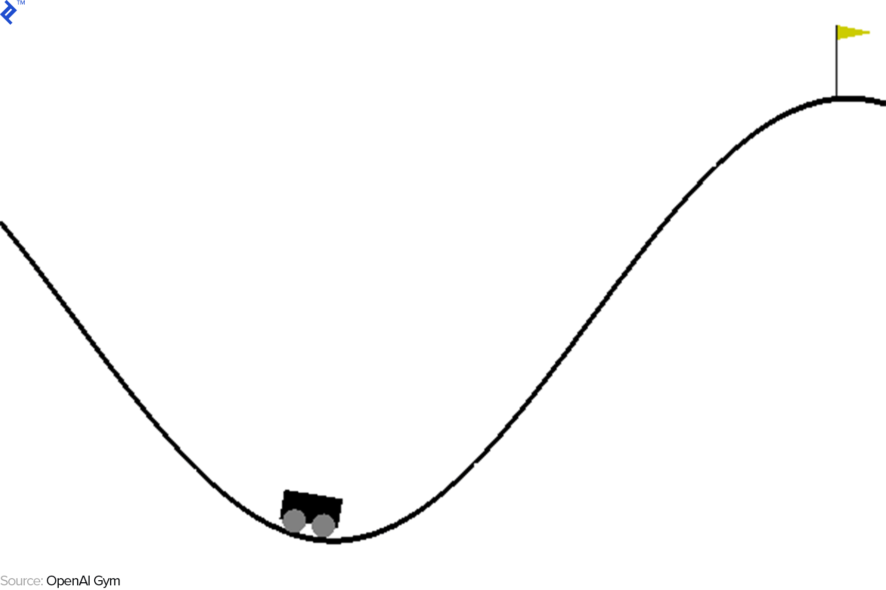

# Deep Q-Learning

## Mountain-Car

### Environment Design
Used OpenAI Gym Environment. Refer to [wiki](https://github.com/openai/gym/wiki/MountainCar-v0) for details.

### Observations
####Comparing various learning rates

| 0.001 | 0.01 | 0.1 |
| --- | --- | --- |
|  |  |  |
#### Result: Best performence when learning rate is 0.001 

#### DQN vs DDQN
| DQN | DDQN |
| --- | --- |
|  |  |

## Pong 
Due to resource limitations, i was not able to produce results.