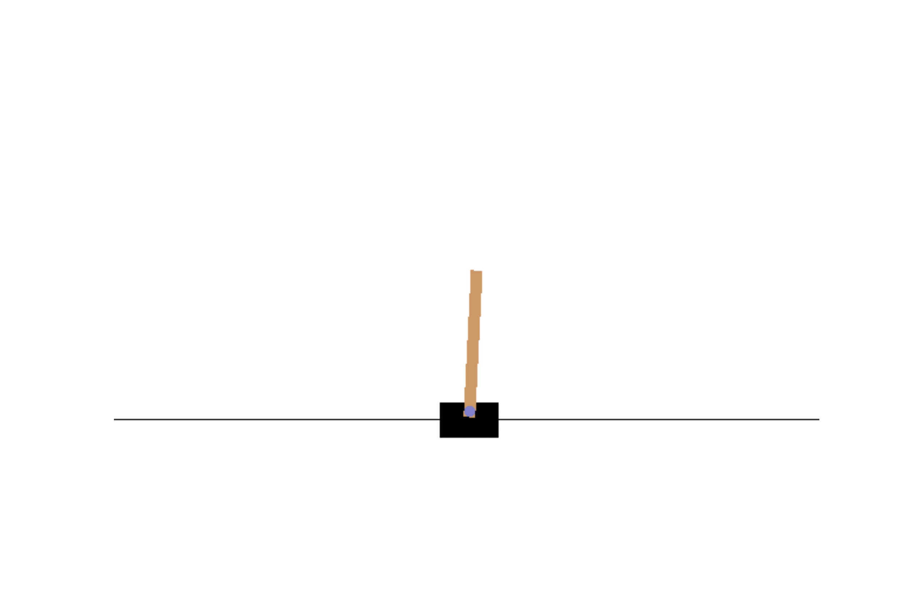

# Policy Gradient

## CartPole

### Environment
Used OpenAI Gym Environment. Refer to [wiki](https://github.com/openai/gym/wiki/CartPole-v0) for details.

### Observation
Comparing all possible combinations of reward-to-go and advantage-normalization

| reward-to-go /  advantage-normalization | False | True |
| --- | --- | --- |
| False |  |  |
| True |  |  |
#### Result: Best results were obtained using both reward-to-go and advantage-normalization 

## LunarLander

### Observation
Comparing all possible combinations of reward-to-go and advantage-normalization

| reward-to-go /  advantage-normalization | False | True |
| --- | --- | --- |
| False |  |  |
| True |  |  |